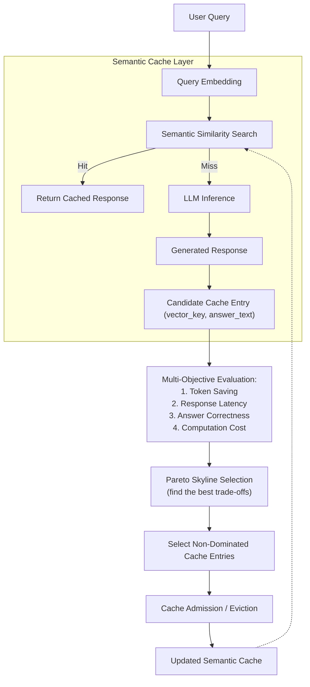

# Pareto-Optimized Multi-Objective Semantic Cache Management for Large Language Models

A semantic caching system for LLM chat services, built on top of [SCALM](https://arxiv.org/abs/2406.00025) (Semantic Caching for Automated Chat Services with Large Language Models). This project extends SCALM's single-score, rank-based cache admission and eviction with **Pareto Skyline multi-objective optimization** — jointly considering token savings, response latency, answer correctness, and computation cost instead of a single heuristic rank.

---

## Overview

LLM chat services incur significant latency and inference cost per query. Semantic caching addresses this by reusing cached responses for semantically similar queries instead of recomputing them.

Most existing semantic caches, including SCALM, make cache decisions using a **single heuristic score** (usually token savings), ignoring other factors that matter in production — latency, correctness, and compute cost. This project treats cache admission and eviction as a genuine **multi-objective problem**, retaining only cache entries that represent the best trade-offs across all objectives at once.

## Proposed System

1. **Semantic clustering** — user queries are embedded and grouped using hierarchical semantic clustering (SCALM's CO-HSC/SE-HSC approach).
2. **Semantic cache lookup** — a query is checked against the cache via similarity search; a hit returns the cached response directly, a miss is forwarded to the LLM.
3. **Multi-objective evaluation** — every candidate cache entry is scored across multiple objectives simultaneously: token savings, response latency, answer correctness, and computation cost.
4. **Pareto Skyline Selection** — instead of a single weighted score, the system retains only **non-dominated (Pareto-optimal) cache entries**.
5. **Adaptive cache admission/eviction** — decisions adjust as the workload and cache state change.

## Architecture



## Repository Structure

```
├── backend
│   ├── __init__.py
│   ├── requirements.txt
│   ├── baselines
│   │   ├── __init__.py
│   │   └── gptcache.py
│   ├── classifier
│   │   ├── __init__.py
│   │   ├── domain_classifier.py
│   │   └── volatility_classifier.py
│   ├── domain
│   │   ├── __init__.py
│   │   └── entities.py
│   ├── embedding
│   │   ├── __init__.py
│   │   ├── mock_embedding.py
│   │   ├── sentence_transformer_provider.py
│   │   └── token_counter.py
│   ├── evaluation
│   │   ├── __init__.py
│   │   └── metrics.py
│   ├── experiment
│   │   ├── __init__.py
│   │   ├── lmsys_loader.py
│   │   └── moss_loader.py
│   ├── interfaces
│   │   ├── __init__.py
│   │   └── protocols.py
│   ├── pareto
│   │   ├── __init__.py
│   │   ├── admission.py
│   │   ├── dominance.py
│   │   ├── frontier.py
│   │   ├── threshold.py
│   │   └── validator.py
│   ├── scalm
│   │   ├── __init__.py
│   │   ├── clustering.py
│   │   └── validator.py
│   ├── tests
│   │   ├── __init__.py
│   │   ├── test_e2e_cache.py
│   │   ├── test_loader.py
│   │   ├── test_vector_store.py
│   │   └── scalm
│   │       ├── __init__.py
│   │       ├── test_admission_eviction.py
│   │       └── test_clustering.py
│   ├── vector_store
│   │   ├── __init__.py
│   │   ├── faiss_store.py
│   │   └── in_memory.py
│   └── cache
│       ├── __init__.py
│       ├── admission.py
│       ├── eviction.py
│       └── scalm_cache.py
├── data
│   ├── moss-003-sft-no-tools.jsonl
│   └── moss_sample.jsonl
├── frontend
│   ├── src
│   │   ├── App.jsx
│   │   ├── cacheData.js
│   │   ├── main.jsx
│   │   └── styles.css
│   ├── README.md
│   ├── index.html
│   ├── package-lock.json
│   ├── package.json
│   ├── vercel.json
│   └── vite.config.js
├── scripts
│   ├── audit_rank_volatility.py
│   ├── debug_moss.py
│   ├── extract_sample.py
│   ├── run_pareto.py
│   └── run_scalm.py
├── .editorconfig
├── .gitignore
├── README.md
└── .vscode
```

- **`backend/`** — the semantic cache engine itself: embedding, clustering, admission, eviction, and lookup logic. See [`backend/README.md`](backend/README.md) for implementation-level details.
- **`frontend/`** — a lightweight demo UI that visualizes how a query flows through the cache (embedding → similarity search → HIT/MISS → cache update). Live demo: [pareto-semantic-cache-demo](https://pareto-semantic-cache-demo-three.vercel.app/)

## Getting Started

### Backend

```bash
cd backend
pip install -r requirements.txt
pytest tests/ -v
```

### Frontend (demo)

```bash
cd frontend
npm install
npm run dev
```
