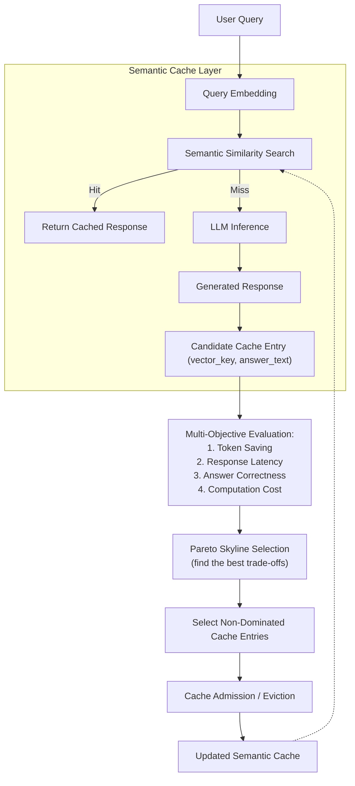

# Pareto-Optimized Multi-Objective Semantic Cache Management for Large Language Models

A research and engineering project that extends [SCALM](https://arxiv.org/abs/2406.00025) (Semantic Caching for Automated Chat Services with Large Language Models) by replacing its single-score, rank-based cache admission and eviction with **Pareto Skyline multi-objective optimization** — jointly considering token savings, response latency, answer correctness, and computation cost instead of a single heuristic rank.

---

## Table of Contents

- [Overview](#overview)
- [Motivation](#motivation)
- [Proposed System](#proposed-system)
- [Architecture](#architecture)
- [Repository Structure](#repository-structure)
- [Current Implementation Status](#current-implementation-status)
- [Getting Started](#getting-started)
- [Research Context](#research-context)
- [Roadmap](#roadmap)
- [References](#references)

---

## Overview

Large Language Model (LLM) chat services incur significant latency and inference cost per query. Semantic caching addresses this by reusing cached responses for semantically similar queries instead of recomputing them. [SCALM](https://arxiv.org/abs/2406.00025) was the first semantics-oriented cache architecture for LLM chat services, using hierarchical semantic clustering and a single ranked score (token-saving-based) to decide what to admit and evict.

This project asks: **can cache admission and eviction be improved by treating it as a genuine multi-objective problem** — token savings, latency, correctness, and compute cost evaluated jointly — rather than collapsing everything into one heuristic rank?

## Motivation

Existing semantic cache systems, including SCALM, share a common limitation:

- Cache decisions are driven by a **single heuristic or single-objective score** (e.g. token savings).
- Other factors that matter in production — **response latency, answer correctness, computational cost** — are ignored or folded into that one score with hand-tuned weights.
- This can lead to **suboptimal cache retention**: entries that save tokens but hurt latency, or vice versa, are not distinguished.

## Proposed System

1. **Semantic clustering** — user queries are embedded and grouped using hierarchical semantic clustering (SCALM's CO-HSC/SE-HSC approach).
2. **Semantic cache lookup** — a query is checked against the cache via similarity search; a hit returns the cached response directly, a miss is forwarded to the LLM.
3. **Multi-objective evaluation** — every candidate cache entry (from a miss) is scored across multiple objectives simultaneously:
   - Token savings
   - Response latency
   - Answer correctness
   - Computation cost
4. **Pareto Skyline Selection** — instead of a single weighted score, the system retains only **non-dominated (Pareto-optimal) cache entries** — entries for which no other entry is strictly better across all objectives at once.
5. **Adaptive cache admission/eviction** — inspired by DKC-LLM's adaptive cache management, decisions adjust as the workload and cache state change.

## Architecture



## Repository Structure

```
├── backend/                 # SCALM-derived semantic cache core (Python)
│   ├── clustering/           # DBSCAN-based hierarchical semantic clustering
│   ├── domain/                # CacheEntry, SemanticPattern, Query entities
│   ├── embedding/             # Embedding provider + token counter abstractions
│   ├── interfaces/            # Core protocols (EmbeddingProvider, VectorStore, AdmissionPolicy, EvictionPolicy)
│   ├── tests/                 # Unit + end-to-end test suite
│   ├── vector_store/          # In-memory cosine-similarity vector store
│   ├── README.md              # Backend-specific implementation notes
│   └── requirements.txt
├── frontend/                 # Interactive demo visualizing cache HIT/MISS/ADD behavior
│   ├── src/
│   │   ├── App.jsx
│   │   ├── cacheData.js
│   │   ├── main.jsx
│   │   └── styles.css
│   ├── README.md
│   ├── index.html
│   ├── package.json
│   └── vite.config.js
└── .gitignore
```

- **`backend/`** — the semantic cache engine itself: embedding, clustering, admission, eviction, and lookup logic. See [`backend/README.md`](backend/README.md) for implementation-level details and paper-fidelity notes.
- **`frontend/`** — a lightweight demo UI that visualizes how a query flows through the cache (embedding → similarity search → HIT/MISS → cache update), used for presentation and demonstration purposes. Live demo: [pareto-semantic-cache-demo](https://pareto-semantic-cache-demo-three.vercel.app/)

## Current Implementation Status

This repository is being built incrementally. The current backend implements a **faithful baseline reproduction of SCALM's own admission/ranking/eviction mechanism** (semantic clustering, rank-seeded LFU eviction, cold/full-cache admission tightening). This is the necessary baseline against which the proposed Pareto-based multi-objective approach will be measured — it is **not yet the Pareto optimization layer** described above.

| Component                                               | Status                                                        |
| ------------------------------------------------------- | ------------------------------------------------------------- |
| Semantic clustering (DBSCAN)                            | ✅ Implemented                                                |
| Cosine-similarity cache lookup                          | ✅ Implemented                                                |
| SCALM baseline admission/eviction                       | ✅ Implemented                                                |
| Multi-objective evaluation (latency, correctness, cost) | ⏳ Not yet implemented                                        |
| Pareto Skyline admission/eviction                       | ⏳ Not yet implemented                                        |
| Real embedding model integration                        | ⏳ Not yet implemented (currently a mock, test-only embedder) |
| Frontend demo                                           | ✅ Implemented (visualization/demo purposes)                  |

See [`backend/README.md`](backend/README.md) for a full breakdown of what is directly from the SCALM paper vs. engineering interpretation vs. planned extension.

## Getting Started

### Backend

```bash
cd backend
pip install -r requirements.txt
pytest tests/ -v
```

### Frontend (demo)

```bash
cd frontend
npm install
npm run dev
```

## Research Context

This project was developed following a structured literature survey covering dynamic semantic caching (DKC-LLM), context-aware semantic retrieval, efficient inference caching (DeepCache), the SCALM semantic caching architecture, and Pareto-based multi-objective optimization (NSGA-II).

**Research gap identified:** existing LLM semantic caching approaches do not integrate Pareto-based multi-objective optimization for cache admission and eviction — cache decisions are made using heuristic or single-objective scoring, even when multiple competing factors (token savings, latency, cost, correctness) are relevant.

**Novelty of this project:**

- Formulates LLM cache admission/eviction as a genuine multi-objective optimization problem.
- Retains only non-dominated (Pareto-optimal) cache entries rather than a single ranked score.
- Combines semantic clustering with multi-objective cache decisions.
- Targets improved cache efficiency, latency, and inference cost relative to SCALM's single-objective ranking.

## Roadmap

1. ~~Faithful SCALM baseline (clustering, admission, eviction, lookup)~~ — done
2. Real embedding model integration + real dataset evaluation (hit ratio / token saving ratio baseline)
3. Multi-objective scoring layer (latency, correctness, compute cost)
4. Pareto Skyline admission/eviction implementation
5. Comparative evaluation: SCALM baseline vs. Pareto-based approach under identical workloads

## References

1. J. Li, C. Xu, F. Wang, I. M. von Riedemann, C. Zhang, and J. Liu, "SCALM: Towards Semantic Caching for Automated Chat Services with Large Language Models," _IEEE/ACM IWQoS_, 2024.
2. A. Khaliq and K. J. Adebayo, "DKC-LLM: Dynamic Knowledge Caching for Large Language Models in Business Applications," _IEEE Access_, vol. 14, pp. 22318–22334, 2026.
3. R. Mohandoss, "Context-based Semantic Caching for LLM Applications," _IEEE Conference on Artificial Intelligence (CAI)_, 2024.
4. Z. Li, Y. Xu, H. Zhang, et al., "DeepCache: Accelerating DNN Inference for Mobile Vision," _ACM MobiCom_, 2023.
5. K. Deb, A. Pratap, S. Agarwal, and T. Meyarivan, "A Fast and Elitist Multiobjective Genetic Algorithm: NSGA-II," _IEEE Transactions on Evolutionary Computation_, vol. 6, no. 2, pp. 182–197, 2002.

---

_Note: citation details above are as provided in project source materials and have not been independently verified against publisher records — please double-check before formal submission._
