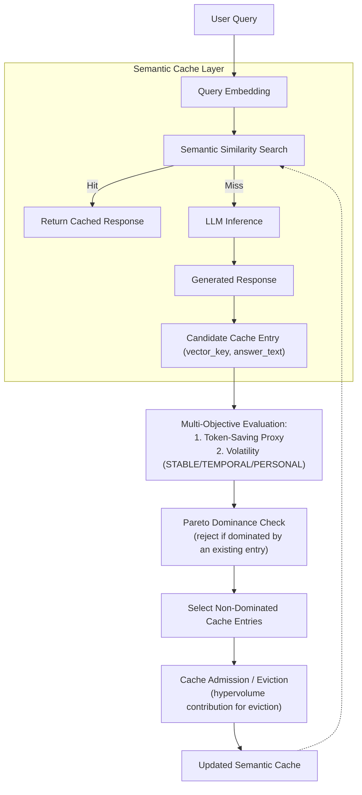

# Pareto-Optimized Multi-Objective Semantic Cache Management for Large Language Models

A semantic caching system for LLM chat services, built on top of [SCALM](https://arxiv.org/abs/2406.00025) (Semantic Caching for Automated Chat Services with Large Language Models). This project extends SCALM's single-score, rank-based cache admission and eviction with **Pareto multi-objective optimization**.

**Status note**: the original design considered four objectives (token savings, latency, correctness, compute cost). What's actually implemented uses **two objectives: token-saving proxy and query volatility** (see `backend/pareto/objectives.py`) — latency and correctness are not yet part of the objective function. See [`PARETO_AUDIT.md`](PARETO_AUDIT.md) for the full, honest record of what's implemented, what's been found and fixed, and what hasn't been validated yet.

---

## Overview

LLM chat services incur significant latency and inference cost per query. Semantic caching addresses this by reusing cached responses for semantically similar queries instead of recomputing them.

Most existing semantic caches, including SCALM, make cache decisions using a **single heuristic score** (usually token savings), ignoring other factors that matter in production. This project treats cache admission and eviction as a genuine **multi-objective problem** — currently token savings vs. volatility (how likely an answer is to go stale or be user-specific) — retaining only cache entries that represent the best trade-offs across both objectives at once, using Pareto dominance rather than a single weighted score.

## Proposed System

1. **Semantic clustering** — user queries are embedded and grouped using hierarchical semantic clustering (SCALM's CO-HSC/SE-HSC approach, used by the SCALM baseline).
2. **Semantic cache lookup** — a query is checked against the cache via similarity search; a hit returns the cached response directly, a miss is forwarded to the LLM.
3. **Multi-objective evaluation** — every candidate cache entry is scored on two objectives: token-saving proxy (bigger cached answers save more tokens per hit) and volatility (a keyword-based STABLE/TEMPORAL/PERSONAL classification — see `backend/classifier/volatility_classifier.py`).
4. **Pareto-based admission and eviction** — a candidate is admitted only if it is NOT dominated by an existing cache entry in both objectives; when eviction is needed, the entry with the lowest hypervolume contribution is removed first.
5. **Adaptive similarity threshold** — the match threshold is adjusted per query domain and volatility (`backend/pareto/threshold.py`), rather than SCALM's single fixed 0.90 threshold.

## Architecture



## Repository Structure

```
├── backend
│   ├── README.md
│   ├── __init__.py
│   ├── requirements.txt
│   ├── baselines/gptcache.py
│   ├── cache/{admission,eviction,scalm_cache}.py
│   ├── classifier/{domain_classifier,volatility_classifier}.py
│   ├── domain/entities.py
│   ├── embedding/{mock_embedding,sentence_transformer_provider,token_counter}.py
│   ├── evaluation/metrics.py
│   ├── experiment/{lmsys_loader,moss_loader,synthetic_dataset}.py
│   ├── interfaces/protocols.py
│   ├── pareto/
│   │   ├── admission.py       # JAS scalar score
│   │   ├── cache.py           # ParetoCache orchestrator
│   │   ├── dominance.py       # Pareto dominance + frontier
│   │   ├── frontier.py        # capacity-aware frontier selection
│   │   ├── hypervolume.py     # hypervolume contribution + pruning
│   │   ├── objectives.py      # objective vector construction
│   │   ├── threshold.py       # adaptive similarity threshold
│   │   └── validator.py       # ParetoValidator
│   ├── scalm/{clustering,validator}.py
│   ├── tests/                 # 95 tests: unit + regression + e2e
│   └── vector_store/{faiss_store,in_memory}.py
├── frontend/                  # demo UI (unchanged in this update)
├── scripts/
│   ├── audit_rank_volatility.py   # Spearman correlation: TSR vs. volatility
│   ├── debug_moss.py
│   ├── extract_sample.py
│   ├── run_pareto.py              # GPTCache vs. SCALM vs. Pareto comparison
│   └── run_scalm.py
├── PARETO_AUDIT.md             # full record of fixes/findings from this update
├── .editorconfig
├── .gitignore
└── README.md
```

- **`backend/`** — the semantic cache engine: embedding, clustering, admission, eviction, and the Pareto extension. See [`backend/README.md`](backend/README.md) for implementation-level details and [`PARETO_AUDIT.md`](PARETO_AUDIT.md) for what was found and fixed.
- **`frontend/`** — a lightweight demo UI that visualizes how a query flows through the cache (embedding → similarity search → HIT/MISS → cache update). Live demo: [pareto-semantic-cache-demo](https://pareto-semantic-cache-demo-three.vercel.app/)

## Current Implementation Status

| Component | Status |
|---|---|
| SCALM baseline (clustering, admission, eviction) | ✅ Implemented — ⚠️ known bug: cache freezes post-warmup, see `PARETO_AUDIT.md` §3 |
| GPTCache flat baseline | ✅ Implemented (rewritten from a broken exact-match version) |
| Pareto dominance, frontier, hypervolume pruning | ✅ Implemented and tested |
| `ParetoCache` (admission + eviction) | ✅ Implemented |
| Volatility / domain classifiers | ✅ Implemented, bug-fixed |
| Rank-volatility correlation audit | ✅ Implemented — **not yet run on real data** |
| Real-dataset validation (MOSS/LMSYS) | ⏳ Requires network access outside this environment |
| Latency / correctness as objectives | ❌ Not implemented — current objectives are token savings + volatility only |

## Getting Started

### Backend

```bash
cd backend
pip install -r requirements.txt
pytest tests/ -v
```

### Frontend (demo)

```bash
cd frontend
npm install
npm run dev
```
